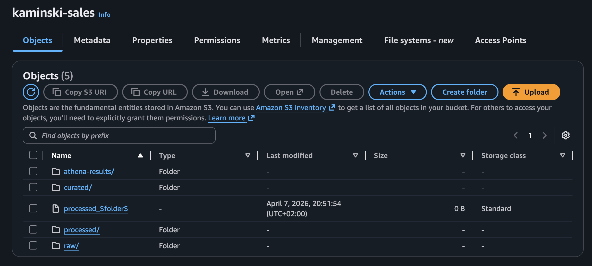
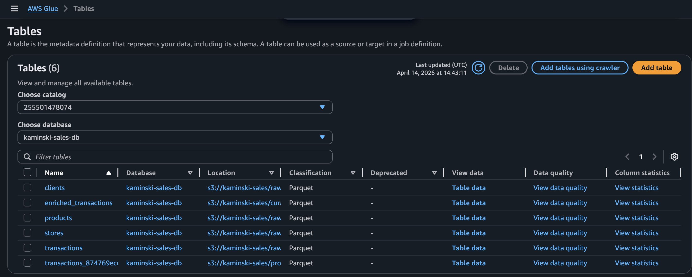
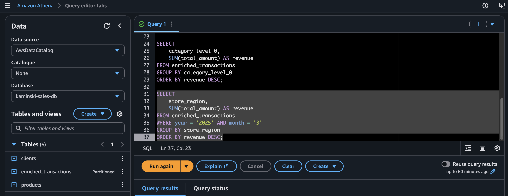

# Customer Segmentation Pipeline on AWS
End-to-end retail data pipeline built on AWS (S3, Glue, Athena), using a fully synthetic dataset to simulate real-world customer behavior and perform segmentation with KMeans.


## 🚀 TL;DR

Built an end-to-end AWS data pipeline to segment customers using KMeans.

- Data lake on S3 (raw / processed / curated)
- ETL with AWS Glue (Spark)
- SQL analytics with Athena
- Customer segmentation (KMeans)

> Result: identified 4 actionable customer segments for marketing strategies.


## Overview
Real-world retail datasets are rarely accessible due to privacy and commercial constraints. 
To overcome this, a synthetic dataset was generated to replicate realistic customer behavior, product distributions, and transaction patterns, while remaining suitable for scalable processing in a cloud environment.

It covers:
- synthetic data generation (clients, stores, products, transactions)
- cloud data pipeline using AWS
- feature engineering
- customer segmentation

The goal is to transform raw transactional data into business insights.


## Architecture

```
Data Generation (Python)
        ↓
S3 (Raw Layer)
        ↓
Glue ETL (Processing & Partitioning)
        ↓
S3 (Processed / Curated Layers)
        ↓
Athena (SQL Analytics)
        ↓
Customer Segmentation (KMeans)
```

The pipeline follows a layered data lake architecture:

- Raw layer: source data stored in S3
- Processed layer: transaction data partitioned by time
- Curated layer: enriched dataset combining all business entities
- Analytics layer: customer segmentation using Python


## Data model
The dataset includes:

- Clients
- Stores
- Products
- Transactions

The curated dataset joins these tables to provide a complete view of each transaction.


## Sample Data

A subset of the dataset is available in the `data_sample/` folder for quick exploration.

The full dataset can be reproduced by running the data generation notebook.


## Pipeline steps 
1. Generated synthetic retail dataset in Python
2. Stored raw data in S3
3. Created metadata tables using AWS Glue Data Catalog
4. Queried raw data using Amazon Athena
5. Built a Glue ETL job (Spark) to partition transaction data by year and month, and registered it in the Glue Data Catalog for efficient querying in Athena
6. Built a curated dataset by joining all entities (clients, stores, products, transactions)
7. Queried curated data in Athena
8. Built customer-level features
9. Applied KMeans clustering for segmentation


## 📊 AWS Pipeline in Action

### S3 Data Lake Structure


### Glue Data Catalog


### Athena Query Example



## What this project demonstrates 
- Data ingestion
- Data lake architecture (raw / processed / curated)
- Batch processing
- Cloud ETL (AWS Glue)
- Data partitioning for performance
- SQL-based analytics (Athena)
- Feature engineering
- Unsupervised machine learning


## Customer segmentation 
Customers were segmented based on:

- total spend
- transaction frequency
- recency
- basket size
- product diversity


## Results 
The model identified four main customer segments:

- High-value customers
- Regular customers
- Bulk buyers
- Low engagement customers


## Business insights
- High-value customers should be retained through loyalty programs
- Bulk buyers can be targeted to increase purchase frequency
- Low engagement customers can be reactivated


## Design Choices

- Synthetic data was used to simulate realistic retail behavior while avoiding privacy constraints
- Data was stored in Parquet format for efficient querying
- Transaction data was partitioned by year and month to optimize Athena performance
- Glue Data Catalog was used to expose datasets as queryable tables
- Feature engineering was performed at both basket and customer level to capture behavioral patterns


## Tech stack 
- Python
- Pandas / NumPy
- scikit-learn
- AWS S3
- AWS Glue
- AWS Athena
- Parquet


## Future improvements
- pipeline automation (Glue workflows)
- dashboard (Power BI / Tableau)
- real-time ingestion
